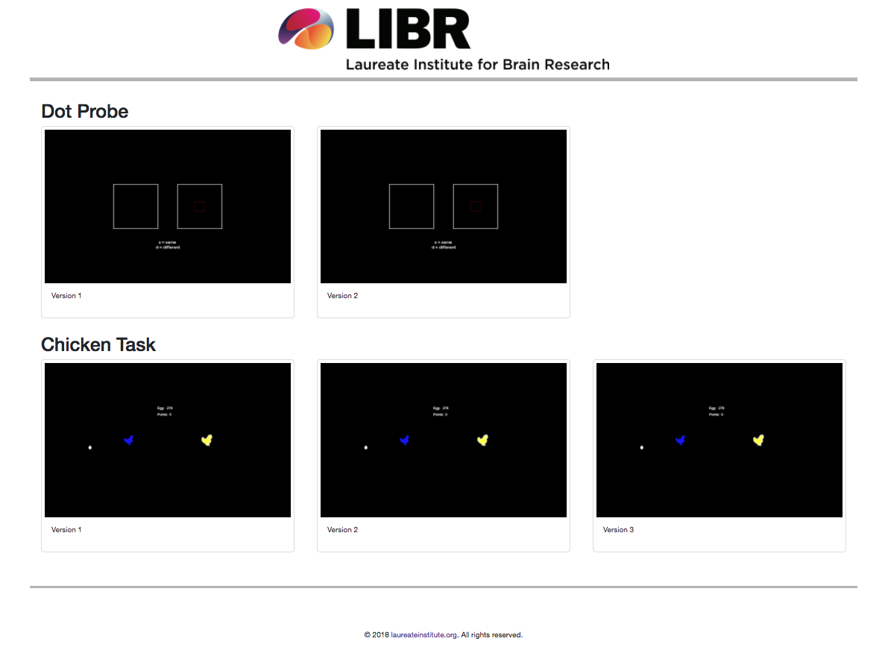

# Brain Workout

Mechanical Turk Web application for Online Tasks


# To Install on a new server
- Install mysql
- install nodejs

## Setup Mysql
- create database with these settings:
```
     user	: "weblogin",
     password	: "U5AZwEpM",
     database	: "mk_turk1"
```

## Run node js
```
$ cd mkturk-1
$ node mkturk-1.js
```


---

### Creating New Task
Tasks are created used [psytoolkit](https://www.psytoolkit.org/). 

The overall workflow to create a task is:
1) Create Task on PsyToolkit
	* Each task has is own git repo, since the task itself, gets modified more than this site.
2) Download Offline PsyToolkit Experiment
3) Modify experiement HTML code to fit with this app
	* It is easier to modify to simliary task under `task/[TASK].html`

4) Store the html code under `task/`

---
### How the node app works

**mkturk-1.js** is the main central code that runs the entire app. It uses SQL to keep track of subject's info as well as their status through the study.
Refer to sql structure section to get more info about how this works. All online tasks and surveys are done client side and only data is saved server side.

### SQL Structure

SQL database contains 2 tables. 

* Tables
	* **dot_probe1** 
		- mkturk_id
		- email
		- remind
		- time_created
		- time_ready
	* **dp_status**
		- mkturk_id
		- task_dotprobe_T1
		- task_dotprobe_T2
		- survey_demo_T1
		- survey_demo_T2
		- survey_phq_T1
		- survey_phq_T2
		- survey_oasis_T1
		- survey_oasis_T2
		- survey_asi_T1
		- survey_asi_T2

The sql structure separated tables by the user info and their status. **dot_probe1** table hols only information about the user's info. **dp_status** is used to hold the status of the user's tasks. This was created so that if the user happens to finish halfway through the surveys or the online task, it will redirect them to their unfinished 'job'. The tables was also setup by tasks since, the studies will uses differente task, and could easily be foreked to for an entirely new experiment.

This particular pilot study requres the mkturk user to tak 3 surveys in 2 sessions (hence the T1/T2). All the survey data get saved to the `surveys/data/` folder and the online task data get saved to `task/data/` directory.

### Emailing Users
Notifying users of when to start session 2 is done through the [mailgun API](https://www.mailgun.com/). This API allows to send 10,000 emails a month at no cost. 

### CDN
Rather than having the images hosted in the VM, All images are using a CDN [Cloudinary API](https://cloudinary.com/). This API allows us to host 300,000 imges and videos at no cost.


# All pages in this web app
These are all the available pages that can be accessed that are also used through the use of the program.

- [Workouts Page (list of all the online task)](http://brainworkout.paulus.libr.net/workouts)
- [Complete Page (Page to show when user has completed study)](http://brainworkout.paulus.libr.net/completed)
- [Demographics Survey](http://brainworkout.paulus.libr.net/?survey=demo)
- [PHQ-8 Survey](http://brainworkout.paulus.libr.net/?survey=phq)
- [OASIS Survey](http://brainworkout.paulus.libr.net/?survey=oasis)
- [ASI Survey](http://brainworkout.paulus.libr.net/?survey=asi)
- [PANAS Survey](http://brainworkout.paulus.libr.net/?survey=panas)
- [Dot Probe Version 1 for Session 1](http://brainworkout.paulus.libr.net/?task=dotprobe&session=1)
- [Dot Probe Version 2 for Session 2](http://brainworkout.paulus.libr.net/?task=dotprobe&session=2)
- [Chicken Task Version 1](http://brainworkout.paulus.libr.net/?task=chicken&session=1)
- [Chicken Task Version 2](http://brainworkout.paulus.libr.net/?task=chicken&session=2)
- [Chicken Task Version 3](http://brainworkout.paulus.libr.net/?task=chicken&session=3)


